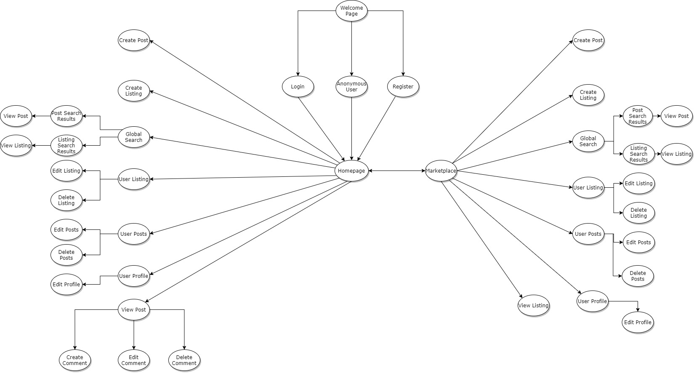

# Timeless - A Passionate Community Forum Focused On Watches
## Third Project : Data-Centric Development Milestone Project
A live demo of this project can be viewed [here](https://timeless-project-3.herokuapp.com/). 

This project utilizes a hybrid combination of single-page application elements as well as multi-page-application elements to bring out the full capabilities of a forum with high functionality.In addition, you may use the dummy account to access the website to see additional functionalities that are only available to registered users.

Dummy User Account
- Username: sroscampd@hc360.com
- Password: slamdunk9

### Disclaimer
Posts and listings populated by the various users as seen on the forum  are mainly used for the presentation of the demo.Therefore, the users that were being used are the different accounts that I have made to used to populate the forum and are not actual users of the forum. 

## UI/UX
### Strategy
#### User Stories
Watch Collectors:
1. Have meaningful discussions and share information about watches with other watch collectors
2. Make a listing and be able to sell their watches to other users

Gift Buyers:
1. Gain information on how to purchase a watch as a gift for others
2. Make deals with other users on purchasing a watch

Site Owner's Goals:
1. To provide a warm community environment for users to be able to interact with each other and exchange information
2. Provide a platform for users to sell their watches to other users

Proposed Solution:
Create a dynamic forum that would allow different types of users to be have the ability to post and market their watches online.

### Scope
#### Required Functionalities
1. CREATE/READ/UPDATE/DELETE (CRUD) Functionality
- Listings: Users must be able to read listings, edit their own listings,delete their own listings and create a listing.
- Posts: Users must be abe to read posts, edit their own posts, delete their own posts and create a post.
- Profile: Users must be able to see their profile information and edit their own profile information
2. Backend Storage
- Listings data, Posts data, User Account Data and Profile Data will all be stored using a backend database
3. User Interaction
- Users able to upvote and downvote a post.
- Users will be able to like a listing. 
- Users will be able to search for their post or listing 
- Users will be able to filter the posts and listings based on their desired requirements
4. Presentation and Responsiveness
- Users should be able to view the web application through different platform devices
- Posts and listings should be displayed in a clear and neat manner throughout the webpage.

### Structure

Taking inspiration from a hub-and-spoke design, the website is designed in a way that would allow all users to be able to navigate through the site easily as well as for clear organisation of website content.

Sequence of Navigation
1. Welcome Page
- Users will be able to choose to continue to browse as guests, register for an account or login to the website.
2. Homepage
- At the homepage, all users including guests will have the ability to navigate through the website with anonymous users having restrictions imposed.
- Anonymous Users would be restricted to access of global search, marketplace,homepage and the viewing of posts and listings.
- Registered Users would be able to freely navigate through the website with access to all features and be able to create,edit,delete and update posts and listings on the website.
3. Listings and Posts
- All users including anonymous users will be able to view posts and listings
- Registered Users have the ability to create,edit and delete their own posts and listings
4. Comments
- Only Registered Users will have the ability to create comments,edit and delete their own comments

### Skeleton

### Surface
Images used in the project were related to watches or community to promote a healthy and warm community of users interested in watches.

Fonts used such as Roboto, Ubuntu, Georgia and Verdana are used to contribute to the professional look of the forum.

## Features
### Current Features
-  Account system with login authentication
-  Responsive web design for different platform devices
-  Global search for users to search for listing or post
-  Create/Edit/Read/Delete Posts
-  Create/Edit/Read/Delete Listings
-  Create/Edit/Read/Delete Comments
-  Filter Buttons to sort Posts in either most recent or most popular based on vote count.
-  Filter Buttons to sort Listings in either most recent or most popular based on likes
-  Search bar at the navigation top bar used to search for post or listing title depending on whether is at the homepage or marketplace respectively.
- Upvote and Downvote buttons to allow users to update the vote number of the posts 
- Like button to allow users to update the like number of the listing
- User Menu Navigation for users to navigate to different parts of the website at homepage or marketplace

### Features Left To Implement
- Allow Users to Chat to Buy with other users in real time
- Setting up reviews section for users to be able to deal with more confidence in the marketplace
- Better Pagination System in placed ssuch as infinite scrolling features for posts and listings
- Additional Sorting Features for listings such as sorting by price
- Allow Users to share the posts or listings to social media platforms
- Allow posts,comments and listings created by summernote to actually display the correct formatting without disrupting the overall page layout.

## Technologies Used
- HTML 
- CSS
- Javascript
- JQuery
- Font Awesome
- Flask
- Pymongo
- Flask-Login
- Passlib
- Jinja2
- BeautifulSoup 4
- Python-dotenv
- dnspython
- MongoDB
- Google Fonts
- Bootstrap 
- AOS Animation
- Summernote
- Toastr
- country_list
- Visual Studio Code
- Heroku
- Github
- Git
- gunicorn
- Cloudinary

### Flask
The web framework used in the development of the webpage that is reponsible for the key essential features such as routing, validation of forms and implementing key functions of the webpage. 

### Flask-Login
Used to provide basic security and privacy features and to enable an account login system.

### Visual Design
1. Toastr
- Used to inform the user on the result of an action on the webpage such as submission of a form
2. AOS Animation
- Used to enhance the visual display of the welcome page to give users a good first impression.
3. Bootstrap 
- Used to layout and design the page with custom bootstrap settings in place
4. Summernote
- Allows users to customize their posts,listings or comments with the tools available in the toolbar.However, this is a feature that has yet to be implemented.
5. BeautifulSoup
- Takes in the input of the summernote and converts it to raw text.
6. Google Fonts
- To enhance the overall display of the webpage
7. Cloudinary
- To allow users to upload images for their listings

### Security
1. passlib
- Allows for encryption for passwords
2. python-dotenv
- Prevents senstive information from being uploaded to github

### Library Tools
1. country_list
- Used to extract a list of available countries to be used as a select form field.

### Backend Tools
1. Pymongo
- Used to interact with MongoDB database 
2. dnspython
- Used for establishment of connection to MongoDB database

## Programming Methodology
### Form Validation
Upon submission of a form, there will be validation in place that is handled through condition checkers. An error accumulator which is a dictionary is used to store the errors and if the error accumulator has received errors, the user will be notified through a danger toastr message of a failed form submission.
### Implementation of Likes/Upvotes/Downvotes
Through the use of AJAX, the functionality of the like button, upvote button and downvote button is created such that when the user clicks on the button the page should not refresh and the vote count or the like count will be updated accordingly. Furthermore, the updated number will also be saved into the database accordingly.

### Security Control
- Through the use of .env file, important and sensitive data such as secret keys are carefully hidden away so that they are not leaked into the publc.
- Passlib library is used to encrypt passwords when the password is saved into the database to prevent unauthorized personnel from retrieving the passwords easily upon access to the database

### Source Control
- Github is used to track and manage any changes in the development of the project

## Database Design
### ER Diagram
