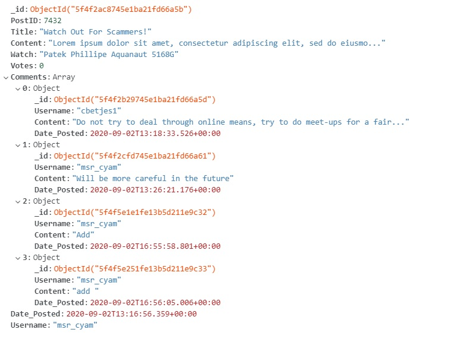
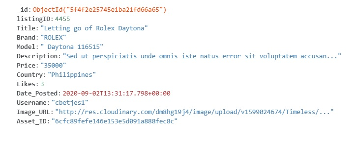
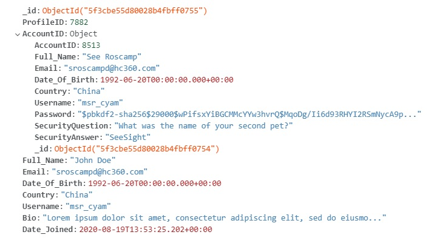
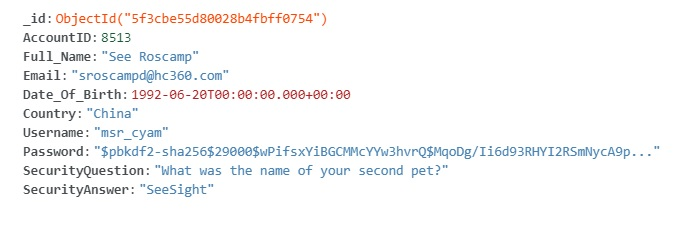

# Timeless - A Passionate Community Forum Focused On Watches
## Third Project : Data-Centric Development Milestone Project
A live demo of this project can be viewed [here](https://timeless-project-3.herokuapp.com/). 

This project utilizes a hybrid combination of single-page application elements as well as multi-page-application elements to bring out the full capabilities of a forum with high functionality.In addition, you may use the dummy account to access the website to see additional functionalities that are only available to registered users.

Dummy User Account
- Username: sroscampd@hc360.com
- Password: slamdunk9

### Disclaimer
Posts and listings populated by the various users as seen on the forum  are mainly used for the presentation of the demo.Therefore, the users that were being used are the different accounts that I have made to used to populate the forum and are not actual users of the forum. 

## UI/UX
### Strategy
#### User Stories
Watch Collectors:
1. Have meaningful discussions and share information about watches with other watch collectors
2. Make a listing and be able to sell their watches to other users

Gift Buyers:
1. Gain information on how to purchase a watch as a gift for others
2. Make deals with other users on purchasing a watch

Site Owner's Goals:
1. To provide a warm community environment for users to be able to interact with each other and exchange information
2. Provide a platform for users to sell their watches to other users

Proposed Solution:
Create a dynamic forum that would allow different types of users to be have the ability to post and market their watches online.

### Scope
#### Required Functionalities
1. **CREATE/READ/UPDATE/DELETE (CRUD) Functionality**
- Listings: Users must be able to read listings, edit their own listings,delete their own listings and create a listing.
- Posts: Users must be abe to read posts, edit their own posts, delete their own posts and create a post.
- Profile: Users must be able to see their profile information and edit their own profile information
2. **Backend Storage**
- Listings data, Posts data, User Account Data and Profile Data will all be stored using a backend database
3. **User Interaction**
- Users able to upvote and downvote a post.
- Users will be able to like a listing. 
- Users will be able to search for their post or listing 
- Users will be able to filter the posts and listings based on their desired requirements
4. **Presentation and Responsiveness**
- Users should be able to view the web application through different platform devices
- Posts and listings should be displayed in a clear and neat manner throughout the webpage.

### Structure


Taking inspiration from a hub-and-spoke design, the website is designed in a way that would allow all users to be able to navigate through the site easily as well as for clear organisation of website content.

Sequence of Navigation
1. **Welcome Page**
- Users will be able to choose to continue to browse as guests, register for an account or login to the website.
2. **Homepage**
- At the homepage, all users including guests will have the ability to navigate through the website with anonymous users having restrictions imposed.
- Anonymous Users would be restricted to access of global search, marketplace,homepage and the viewing of posts and listings.
- Registered Users would be able to freely navigate through the website with access to all features and be able to create,edit,delete and update posts and listings on the website.
3. **Listings and Posts**
- All users including anonymous users will be able to view posts and listings
- Registered Users have the ability to create,edit and delete their own posts and listings
4. **Comments**
- Only Registered Users will have the ability to create comments,edit and delete their own comments

### Skeleton
Wireframes used for the project can be found [here](readme/project_3.pdf)
### Surface
Images used in the project were related to watches or community to promote a healthy and warm community of users interested in watches.

Fonts used such as Roboto, Ubuntu, Georgia and Verdana are used to contribute to the professional look of the forum.

## Features
### Current Features
-  Account system with login authentication
-  Responsive web design for different platform devices
-  Global search for users to search for listing or post
-  Create/Edit/Read/Delete Posts
-  Create/Edit/Read/Delete Listings
-  Create/Edit/Read/Delete Comments
-  Filter Buttons to sort Posts in either most recent or most popular based on vote count.
-  Filter Buttons to sort Listings in either most recent or most popular based on likes
-  Search bar at the navigation top bar used to search for post or listing title depending on whether is at the homepage or marketplace respectively.
- Upvote and Downvote buttons to allow users to update the vote number of the posts 
- Like button to allow users to update the like number of the listing
- User Menu Navigation for users to navigate to different parts of the website at homepage or marketplace

### Features Left To Implement
- Allow Users to Chat to Buy with other users in real time, therefore, the button chat to buy is disabled.
- Setting up reviews section for users to be able to deal with more confidence in the marketplace
- Better Pagination System in placed ssuch as infinite scrolling features for posts and listings
- Additional Sorting Features for listings such as sorting by price
- Allow Users to share the posts or listings to social media platforms
- Allow posts,comments and listings created by summernote to actually display the correct formatting without disrupting the overall page layout.
- Allow users to upvote once or downvote once only. If the upvote button is clicked, the button should be disabled and the downvote button should only be allowed to click to change the vote count. Likewise for the downvote button, if the downvote button is clicked, the button should be disabled and the upvote button should only be allowed to click to change the vote count.
- Allow users to only like once or remove the like

## Technologies Used
- HTML 
- CSS
- Javascript
- JQuery
- Font Awesome
- Flask
- Pymongo
- Flask-Login
- Passlib
- Jinja2
- BeautifulSoup 4
- Python-dotenv
- dnspython
- MongoDB
- Google Fonts
- Bootstrap 
- AOS Animation
- Summernote
- Toastr
- country_list
- Visual Studio Code
- Heroku
- Github
- Git
- gunicorn
- Cloudinary

### Flask
The web framework used in the development of the webpage that is reponsible for the key essential features such as routing, validation of forms and implementing key functions of the webpage. 

### Flask-Login
Used to provide basic security and privacy features and to enable an account login system.

### Visual Design
1. Toastr
- Used to inform the user on the result of an action on the webpage such as submission of a form
2. AOS Animation
- Used to enhance the visual display of the welcome page to give users a good first impression.
3. Bootstrap 
- Used to layout and design the page with custom bootstrap settings in place
4. Summernote
- Allows users to customize their posts,listings or comments with the tools available in the toolbar.However, this is a feature that has yet to be implemented.
5. BeautifulSoup
- Takes in the input of the summernote and converts it to raw text.
6. Google Fonts
- To enhance the overall display of the webpage
7. Cloudinary
- To allow users to upload images for their listings

### Security
1. passlib
- Allows for encryption for passwords
2. python-dotenv
- Prevents senstive information from being uploaded to github

### Library Tools
1. country_list
- Used to extract a list of available countries to be used as a select form field.

### Backend Tools
1. Pymongo
- Used to interact with MongoDB database 
2. dnspython
- Used for establishment of connection to MongoDB database


## Programming Methodology
### Form Validation
Upon submission of a form, there will be validation in place that is handled through condition checkers. An error accumulator which is a dictionary is used to store the errors and if the error accumulator has received errors, the user will be notified through a danger toastr message of a failed form submission.
### Implementation of Likes/Upvotes/Downvotes
Through the use of AJAX, the functionality of the like button, upvote button and downvote button is created such that when the user clicks on the button the page should not refresh and the vote count or the like count will be updated accordingly. Furthermore, the updated number will also be saved into the database accordingly.

### Security Control
- Through the use of .env file, important and sensitive data such as secret keys are carefully hidden away so that they are not leaked into the publc.
- Passlib library is used to encrypt passwords when the password is saved into the database to prevent unauthorized personnel from retrieving the passwords easily upon access to the database

### Source Control
- Github is used to track and manage any changes in the development of the project

## Database Design
### ER Diagram


### Data Model Design For MongoDB
For this project, a hybrid approach was taken and a mixture of embedded data was used together with referencing to allow for the relationships to be established.

In general, embedded data was used to establish the one-to-many relationships such as the posts and comments, while referencing was used as well for profile and account.

### Sample Documents of MongoDB
<div align="center">
<h4>Posts</h4>

</div>
<div align="center">
<h4>Listing</h4>

</div>
<div align="center">
<h4>Profile</h4>

</div>
<div align="center">
<h4>User</h4>

</div>

## Testing
All testing was carried out manually and the results of the testing are shown below:
| Test Number | Event                                                                                               | Expected Observation                                                                                                                                                                                                                                                                                                                                                                                                                                                                                                                                                                                                                       | Actual Observation                                                                                                |
|-------------|-----------------------------------------------------------------------------------------------------|--------------------------------------------------------------------------------------------------------------------------------------------------------------------------------------------------------------------------------------------------------------------------------------------------------------------------------------------------------------------------------------------------------------------------------------------------------------------------------------------------------------------------------------------------------------------------------------------------------------------------------------------|-------------------------------------------------------------------------------------------------------------------|
| 1           | Welcome screen AOS animation                                                                        | Fade in animation on the welcome screen                                                                                                                                                                                                                                                                                                                                                                                                                                                                                                                                                                                                    | As Expected                                                                                                       |
| 2           | Welcome screen to login screen transition                                                           | Transitions without reloading of page                                                                                                                                                                                                                                                                                                                                                                                                                                                                                                                                                                                                      | As Expected                                                                                                       |
| 3           | Login page validation                                                                               | Will reject user login if invalid fields                                                                                                                                                                                                                                                                                                                                                                                                                                                                                                                                                                                                   | As Expected                                                                                                       |
| 4           | Register page validation                                                                            | Will reject user if registration fields contain invalid inputs                                                                                                                                                                                                                                                                                                                                                                                                                                                                                                                                                                             | As Expected                                                                                                       |
| 5           | Upon registration, redirect to homepage                                                             | User will be redirected to homepage upon successful registration with the user menu displaying the correct username and containing the following options global search, home, marketplace, my profile, my posts, my listings,create post and create listing with the option to logout.                                                                                                                                                                                                                                                                                                                                                     | As Expected                                                                                                       |
| 6           | Upon login, redirect to homepage                                                                    | User will be redirected to homepage upon successful login with the user menu displaying the correct username and containing the following options global search, home, marketplace, my profile, my posts, my listings, create post and create listing with the option to logout.                                                                                                                                                                                                                                                                                                                                                           | As Expected                                                                                                       |
| 7           | Clicking browse as guest at the welcome screen                                                      | User will be redirected to homepage with display username as anonymous. User should also only see global search,marketplace and home as the user menu along with the option to login                                                                                                                                                                                                                                                                                                                                                                                                                                                       | As Expected                                                                                                       |
| 8           | Anonymous User clicks on create post at homepage                                                    | User will not be allowed to create a post at all and receive a toastr message                                                                                                                                                                                                                                                                                                                                                                                                                                                                                                                                                              | As Expected                                                                                                       |
| 9           | Anonymous User clicks on create listing at marketplace                                              | User will not be allowed to create a listing at all and receive a toastr message                                                                                                                                                                                                                                                                                                                                                                                                                                                                                                                                                           | As Expected                                                                                                       |
| 10          | Anonymous User clicks on a post to view it                                                          | User will be allowed to view the post and be redirected to the view post page                                                                                                                                                                                                                                                                                                                                                                                                                                                                                                                                                              | As Expected                                                                                                       |
| 11          | Anonymous User clicks on a listing to view it                                                       | User will be allowed to view the listing and be redirected to the view listing page                                                                                                                                                                                                                                                                                                                                                                                                                                                                                                                                                        | As Expected                                                                                                       |
| 12          | Anonymous User tries to submit a comment at the view post page                                      | User will not be allowed to make a comment for the post and receive a toastr message                                                                                                                                                                                                                                                                                                                                                                                                                                                                                                                                                       | Failed, Internal  Server Error Occurred. Attribute Error: 'AnonymousUserMixin' object has no attribute 'username' |
| 13          | Anonymous User tries to search for post title at the top search bar in the homepage                 | The correct search result should be displayed with the page reloading.                                                                                                                                                                                                                                                                                                                                                                                                                                                                                                                                                                     | As Expected                                                                                                       |
| 14          | Anonymous User tries to search for listing title at the top search bar in the marketplace           | The correct search result should be displayed with the page reloading                                                                                                                                                                                                                                                                                                                                                                                                                                                                                                                                                                      | As Expected                                                                                                       |
| 15          | Anonymous User tries to filter the posts by most recent and most popular at the homepage            | Posts are sorted according to most recent when the most recent button is clicked with the most recent post at the top, while if the most popular button is clicked  the posts should be sorted according to the most popular at the top.                                                                                                                                                                                                                                                                                                                                                                                                   | As Expected                                                                                                       |
| 16          | Anonymous User tries to filter the listings by most recent and most popular at the homepage         | Listings are sorted according to most recent when the most recent button is clicked with the most recent post at the top, while if the most popular button is clicked the listings should be sorted according to the most popular at the top.                                                                                                                                                                                                                                                                                                                                                                                              | As Expected                                                                                                       |
| 17          | Logged In User clicks to view a post at the homepage                                                | Redirects the user to the view post page with the correct post displayed                                                                                                                                                                                                                                                                                                                                                                                                                                                                                                                                                                   | As Expected                                                                                                       |
| 18          | Logged In User clicks to view a listing at the marketplace                                          | Redirects the user to the view listing page with the correct listing displayed                                                                                                                                                                                                                                                                                                                                                                                                                                                                                                                                                             | As Expected                                                                                                       |
| 19          | Logged In User tries to edit or delete a comment that is not made by the user at the view post page | Error message prompt by the toastr should be displayed                                                                                                                                                                                                                                                                                                                                                                                                                                                                                                                                                                                     | As Expected                                                                                                       |
| 20          | Logged In User tries to edit or delete own comments                                                 | Allow for the comment to either be edited or deleted successfully. If the user decides to edit the comment, the edit comment should be displayed and the user can successfully edit the comment, if the user decides to delete the comment, the  comment will disappear successfully.                                                                                                                                                                                                                                                                                                                                                      | As Expected                                                                                                       |
| 21          | Logged In User tries to filter the posts with most recent or most popular button                    | Posts should be filtered according to the button pressed. If the user clicks on the most recent button, the most recent post will appear at the top,but if the user clicks on the  most popular button, the post with the highest vote count should appear at the top.                                                                                                                                                                                                                                                                                                                                                                     | As Expected                                                                                                       |
| 22          | Logged In User tries to filter the listings with the most recent or most popular button             | Listings should be filtered according to the button pressed. If the user clicks on the most recent button, the most recent listing will appear at the top, but if the user clicks on the most popular button, the listing with the highest likes should appear at the top.                                                                                                                                                                                                                                                                                                                                                                 | As Expected                                                                                                       |
| 23          | Logged In User accessing the global search and searches for listing                                 | Listing search form should appear when the listing radio button is clicked and upon submission of the form, the search results for listing should appear and the user can click on the listing to view the listing.                                                                                                                                                                                                                                                                                                                                                                                                                        | As Expected                                                                                                       |
| 24          | Logged In User accessing the global search and searches for post                                    | Post search form should appear when the post radio button is clicked and upon submission of the  form, the search results for posts should appear and the user can click on the post to view the post.                                                                                                                                                                                                                                                                                                                                                                                                                                     | As Expected                                                                                                       |
| 25          | Anonymous User accessing the global search and searches for listing                                 | Listing search form should appear when the listing radio button is clicked and upon submission of the form, the search results for listing should appear and the user can click on the listing  to view the listing.                                                                                                                                                                                                                                                                                                                                                                                                                       | As Expected                                                                                                       |
| 26          | Anonymous User accessing the global search and searches for post                                    | Post search form should appear when the post radio button is clicked and upon submission of the form, the search results for posts should appear and the user can click on the post to view the post.                                                                                                                                                                                                                                                                                                                                                                                                                                      | As Expected                                                                                                       |
| 27          | Logged In User clicks on my profile at the homepage or marketplace                                  | User will be able to be redirected to the my profile page and the relevant profile information  will be displayed.                                                                                                                                                                                                                                                                                                                                                                                                                                                                                                                         | As Expected                                                                                                       |
| 28          | Logged In User tries to edit the profile                                                            | User will be able to successfully edit the profile only if the form input has no invalid inputs. Toastr message will also be shown in the event of an error in submission and also upon successful submission                                                                                                                                                                                                                                                                                                                                                                                                                              | As Expected                                                                                                       |
| 29          | Logged In User tries to create a post                                                               | User will be able to successfully create a post only if the form input has no invalid inputs. Toastr message will also be shown in the event of an error in submission and also upon successful submission                                                                                                                                                                                                                                                                                                                                                                                                                                 | As Expected                                                                                                       |
| 30          | Logged In User tries to create a listing                                                            | User will be able to successfully create a listing only if the form input has no invalid inputs and the user needs to upload an image for the listing. Toastr message will also be shown in the event of an error in submission and also upon successful submission.                                                                                                                                                                                                                                                                                                                                                                       | As Expected                                                                                                       |
| 31          | Logged In User clicks on my listing through the user menu                                           | User will be redirected to the show user listings page and the page will display all the listings made by the user. User will also be able to edit and delete own listings by interacting with the buttons. Upon clicking on the edit listing button, user will be redirected to the edit listing form and the user will be able to edit the listing successfully if there are no invalid inputs in the form and the user has uploaded an image. Toastr message will be shown in the event of an error in submission and also upon successful submission. If the user deletes off a listing, the listing will also be deleted accordingly. | As Expected                                                                                                       |
| 32          | Logged In User clicks on my posts through the user menu                                             | User will be redirected to the show user posts page and the page will display all the posts made by the user. User will also be able to edit and delete own posts by interacting with the buttons. Upon clicking on the edit post button, user will be redirected to the edit post form and the user will be able to edit the post successfully if there are no invalid inputs in the form. Toastr message will be shown in the event of an error in submission and also upon successful submission. If the user deletes off a post, the post will also be deleted accordingly.                                                            | As Expected                                                                                                       |
| 33          | Logged In User clicks on the pagination buttons on the my posts page                                | User should be able to navigate through the posts if the user has made many posts through the pagination system and if the user clicks on the previous page button, the previous posts located at the previous page will be shown. If the user clicks on the page numbers, the correct posts will also be shown.If the user clicks on the next page button, the next posts located at the next page will be shown as well.                                                                                                                                                                                                                 | As Expected                                                                                                       |
| 34          | Logged In User clicks on the pagination buttons on the my listings page                             | User should be able to navigate through the listings if the user has made many listings through the pagination system and if the user clicks on the previous page button, the previous listings located at the previous page will be shown. If the user clicks on the page numbers, the correct listings will also be shown. If the user clicks on the next page button, the next listings located at the next page will be shown as well.                                                                                                                                                                                                 | As Expected                                                                                                       |
| 35          | Logged In User clicks on the pagination buttons on the view post page for the comments              | User will be able to browse through the comments while viewing the post through the pagination system. The previous page will show previous page comments, while the next page will show the next page comments. If the user clicks on the page numbers, the correct comments will be shown.                                                                                                                                                                                                                                                                                                                                               | As Expected                                                                                                       |
| 36          | Pagination buttons on the search post results form and the search listings results form             | All users are able to browse through the search results and if the user clicks on the  previous page, the previous page results will be shown, while if the user clicks on next page, the next page results will be shown as well. If the user clicks on the page numbers, the correct page will be shown.                                                                                                                                                                                                                                                                                                                                 | As Expected                                                                                                       |
| 37          | Logged In User clicks on logout button                                                              | User will be logged out and redirected to the welcome screen                                                                                                                                                                                                                                                                                                                                                                                                                                                                                                                                                                               | As Expected                                                                                                       |

### Responsiveness
Using the inspector function of Google Chrome, the following devices was used in the testing phase for mobile responsiveness:
- Moto G4
- Galaxy S5
- Pixel 2
- Pixel 2 XL
- iPhone 5/SE
- iPhone 6/7/8
- iPhone 6/7/8 Plus
- iPhone X
- IPad
- Ipad Pro

In the testing of responsiveness to both phone and tablet devices, the webpage application is able to display and layout the correct intended design for the different
pages when tested through these different platforms.

### Bugs
- Downvote button of posts will cause the page to reload 
- If users upload many images into the create listing or edit listing form, only the latest image will be taken into the database.

## Deployment
This website is deployed on [Heroku](https://www.heroku.com). 

To deploy on Heroku
1. Download or Clone the master branch from [github](https://github.com/l0nelyhermit/Timeless)
2. To list all the requirements in requirements.txt, run the following command in terminal:
```
pip3 freeze --local > requirements.txt
```
3. Set Debug to False
4. Procfile need to be created to run gunicorn upon deployment
5. Git push to Heroku Master after all the documents are properly set up
6. Use Your Own MongoDB account to host the database and use your own cloudinary account to host the images uploaded by users
6. All public keys and private keys for the following need to be added to in Heroku Config Vars settings:
    - MongoDB URI : Your Own MONGO_URI
    - Secret Key: Choose Your Own Secret Key
    - Upload Preset: Your Own Upload Preset
    - Cloud Name: Your Own Cloud Name 

## Credits and Acknowledgement
- Bootstrap Snippets : https://bootstrapious.com/snippets
- Background Image For Homepage and Marketplace: https://wallpapercave.com/louis-moinet-watches-wallpapers
- Hero Image For Welcome Users:https://www.pexels.com/photo/close-up-photo-of-wristwatch-2113994/
- Image Used for Login Page:https://www.pexels.com/photo/men-s-white-button-up-dress-shirt-708440/
- Background Image Used for the rest of the webpage: https://www.pexels.com/photo/round-michael-kors-chronograph-watch-2783873/
- Favicon Image: https://favicon.io/emoji-favicons/watch/

### Acknowledgements
- Website was inspired by mainly by reddit


